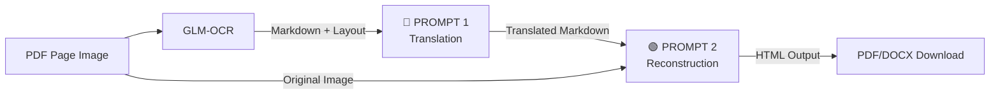

# GLM-5 — All AI Prompts Reference

> **Last Updated:** March 6, 2026  
> **Application:** PDF OCR → Translate → Reconstruct Pipeline  
> **AI Models Used:** Google Gemini (`gemini-2.0-flash`)

---

## Pipeline Flow & Where Each Prompt Is Used



| # | Prompt | File | Model | Purpose |
|---|--------|------|-------|---------|
| 🔵 1 | **Translation Prompt** | [translation_service.py](file:///Users/codegnan2/Desktop/Back-up/GLM-5/backend/app/services/translation_service.py#L83-L122) | Gemini (text-only) | English Markdown → Indian language Markdown |
| 🟢 2 | **Reconstruction Prompt** | [reconstruction_service.py](file:///Users/codegnan2/Desktop/Back-up/GLM-5/backend/app/services/reconstruction_service.py#L99-L157) | Gemini (multimodal: image + text) | Translated Markdown → Layout-matched HTML |

---

## 🔵 Prompt 1: Translation Prompt

**File:** [translation_service.py](file:///Users/codegnan2/Desktop/Back-up/GLM-5/backend/app/services/translation_service.py#L83-L122)  
**Input:** Extracted Markdown from GLM-OCR + target language code  
**Output:** Translated Markdown in the target Indian language  
**Temperature:** `0.1` (very deterministic)  
**Max Tokens:** `16384` (configurable via `GEMINI_MAX_OUTPUT_TOKENS`)  
**Timeout:** `240 seconds`

### Language Style Notes (Injected Dynamically)

Before the prompt, a `LANGUAGE_STYLE_NOTES` dictionary provides language-specific vocabulary guidance:

```python
LANGUAGE_STYLE_NOTES = {
    "Telugu":    "Use classical formal Telugu (గ్రాంథిక భాష)... Prefer క్రింది over కింది, క్రొత్త over కొత్త...",
    "Odia":      "Use formal written Odia (ଶିଷ୍ଟ ଭାଷା)... Prefer ନିମ୍ନରେ over ତଳେ, ନୂତନ over ନୂଆ...",
    "Hindi":     "Use formal Shuddh Hindi (तत्सम)... Prefer निम्नलिखित over नीचे दिया...",
    "Kannada":   "Use formal written Kannada (ಶಿಷ್ಟ ಭಾಷೆ)... Prefer ಕೆಳಗಿನ over ಕೆಳಗೆ...",
    "Tamil":     "Use formal written Tamil (செந்தமிழ்)... Prefer கீழ்க்காண்பவை over கீழே உள்ளது...",
    "Malayalam": "Use formal written Malayalam (ഗ്രന്ഥഭാഷ)... Prefer താഴെ പറയുന്നവ over താഴെ ഉള്ളത്...",
    "Bengali":   "Use formal written Bengali (সাধু ভাষা)... Prefer নিম্নলিখিত over নিচের...",
    "Marathi":   "Use formal written Marathi... Prefer खालीलपैकी over खाली...",
    "Gujarati":  "Use formal written Gujarati... Prefer નીચે મુજબ over નીચે...",
    "Punjabi":   "Use formal written Punjabi (ਸਾਹਿਤਕ ਭਾਸ਼ਾ)... Prefer ਹੇਠਾਂ ਦਿੱਤੇ over ਹੇਠਾਂ...",
}
```

**Fallback** (for any language not in dict):  
`"Use formal written {language} as used in government competitive exam papers. Prefer Sanskrit-origin/tatsama vocabulary over colloquial forms."`

### Full Prompt Template

```text
You are an expert translator specializing in translating English educational/exam
documents to {target_language}.

TASK: Translate the following extracted Markdown content from English to {target_language}.

TRANSLATION STYLE:
- Generate {target_language} in FORMAL COMPETITIVE EXAMINATION style used in
  SSC/Banking/State PSC exams.
- Use standard written {target_language}. Avoid conversational or spoken tone.
- {language_style_note}
- Avoid literal word-by-word translation. Use structured exam phrasing that sounds
  natural in {target_language}.
- Technical terms commonly used in exams (like "compound interest", "ratio",
  "percentage") should use the standard {target_language} equivalents used in
  government exam papers.

CRITICAL RULES:
1.  Translate ALL human-readable text to {target_language} — sentences, instructions,
    directions, question text.
2.  **IGNORE HEADERS/LOGOS**: Completely EXCLUDE any institute names
    (e.g., 'Sreedhar's CCE'), logos, contact details, phone numbers, or branch
    addresses at the top or bottom of the page. Do NOT translate or include them
    in your output. Start directly with the test name, directions, or exam content.
3.  PRESERVE all Markdown formatting exactly (headers, bold, italic, lists, links,
    table syntax).
4.  **TABLE TRANSLATION**: Tables are critical — follow these rules strictly:
    - PRESERVE the Markdown table pipe syntax EXACTLY.
    - TRANSLATE all text inside table cells (headers AND body rows).
    - Keep numbers, dates, and abbreviations inside cells unchanged.
    - DO NOT break the table structure — same number of | pipes per row.
    - Example: `| Year | Students |` → `| సంవత్సరం | విద్యార్థులు |` (for Telugu)
5.  **PRESERVE IMAGE TAGS**: Keep ALL image references in the format
    `` EXACTLY as they appear.
    Do NOT modify, translate, or remove these tags.
6.  DO NOT translate: mathematical symbols, formulas, numbers, dates, measurements,
    proper nouns (SBI, RBI, LIC etc.), option labels (1), 2), 3), 4), 5)).
7.  **FIX MATH FRACTIONS**: OCR badly extracts fractions like `33^1_3`.
    Fix into proper LaTeX: `$33\frac{1}{3}$`.

> **⚠️ Python f-string note:** In the actual Python code, backslashes and braces
> are double-escaped: `$33\\frac{{1}}{{3}}$`. The template above shows the
> *rendered* output that Gemini receives.
8.  **MATH EXPRESSIONS**: Wrap ALL math in LaTeX `$...$`. Examples:
    - `? × 65 ÷ 72` → `$? \times 65 \div 72$`
    - `√256 × ³√1728` → `$\sqrt{256} \times \sqrt[3]{1728}$`
    - `35% of 180 + 18²` → `$35\% \text{ of } 180 + 18^2$`
9.  **HYBRID MATH / ENGLISH OPERATORS**: Don't translate 'of' in math context.
    Keep as rigid formula: `$35\% \text{ of } 180$`.
10. **LITERAL DOLLAR SIGNS**: Escape `$` as `\$` when used for money.
11. PRESERVE the exact order, structure, and spacing of content.
12. Keep question numbers (Q1, Q2, 31., 32.) and option numbers unchanged.
13. Output ONLY the translated Markdown — no explanations, no wrapping!

MARKDOWN CONTENT TO TRANSLATE:
---
{markdown_content}
---

TRANSLATED CONTENT IN {target_language}:
```

---

## 🟢 Prompt 2: Reconstruction Prompt

**File:** [reconstruction_service.py](file:///Users/codegnan2/Desktop/Back-up/GLM-5/backend/app/services/reconstruction_service.py#L99-L157)  
**Input:** Original page image (PNG) + translated Markdown + layout details  
**Output:** HTML matching the original page layout  
**Temperature:** `0.2` (slightly more creative for layout decisions)  
**Max Tokens:** `16384`  
**Timeout:** `180 seconds`  
**Mode:** **Multimodal** — sends both the page image and text prompt to Gemini

### Pre-processing Before Prompt

Before this prompt runs, two checks happen:

1. **Empty page** → If no translated markdown, the entire original page is rendered as a `` (base64 PNG)
2. **Sparse page** (< 10 meaningful words) → Same as above — cover pages, barcode pages, logos-only pages are rendered as full images instead of going through Gemini

### Full Prompt Template

```text
You are an expert document layout specialist. Your output HTML will be rendered
inside an A4-width container (max-width: 680px, padding: 12px 20px). Design your
HTML accordingly.

TASK: Format the ALREADY-TRANSLATED {target_language} content below to match the
layout of the attached original page image.

IMPORTANT: The text is ALREADY in {target_language}. DO NOT translate it again.
Your job is ONLY to:
1. Organize the content to match the original page layout (reading order, sections,
   columns, spacing)
2. Convert Markdown to clean HTML
3. Preserve ALL image tags and convert them to HTML img tags

CRITICAL — LAYOUT & CONTENT ORDERING:
1. Look at the attached ORIGINAL PAGE IMAGE carefully.
2. Output content in EXACTLY the same top-to-bottom reading order as the original.
3. DO NOT reorder, skip, or move any content. If the original shows Question 31
   before Question 32, your HTML must show them in that exact order.
4. If the original has a header/title bar at the top, output it FIRST.
5. TWO-COLUMN LAYOUTS: If the original image is divided into two distinct vertical columns, do NOT just flatten everything into a single long column. Instead, wrap the entire multi-column section in a `<div style="column-count: 2; column-gap: 40px; text-align: justify;">` to replicate the visual two-column flow.
6. Position each element (text, image, table) in the same relative position.

DO NOT TRANSLATE: The content is already in {target_language}. Keep it as-is.

HANDLING IMAGES AND TABLES (CRITICAL MULTIMODAL RULE):
- The input text contains placeholder tags: ``
- Look at the attached ORIGINAL PAGE IMAGE to see what is inside that cropped area.
- Rule 1 (CHARTS/GRAPHS): If the crop area contains a chart, graph, diagram, or
  picture, convert the tag to an HTML img tag:
  ``
  Use max-width:80% for large charts, 50% for smaller diagrams, 30% for icons.
- Rule 2 (TABLES): If the crop area contains a DATA TABLE, DO NOT render as .
  Instead, READ the table structure (rows, columns, cell layout) from the original
  image, and output as a styled HTML <table> using the already-translated
  {target_language} content from the extracted markdown. Do NOT re-translate.
- Rule 3: Use the EXACT SAME crop coordinates — do NOT change the numbers.
- Rule 4: NEVER drop, skip, or omit a crop tag.
- Rule 5: Place images/tables in the EXACT same position as the original.

MATH AND FORMULAS (CRITICAL):
- Math expressions are already in LaTeX format wrapped in `$...$` or `$$...$$`
- Keep ALL math expressions EXACTLY as they appear
- Do NOT modify, unwrap, or translate anything inside `$...$` blocks
- INLINE MATH: If a math expression or percentage (like `$14\\frac{2}{7}\\%$` or `12.5%`) appears inside a sentence, keep it INLINE. Do NOT wrap it in a new `<div>`, `<p>`, or place it on a new line. It must flow naturally in the paragraph.

LAYOUT RULES:
1.  Each QUESTION block: own <div> with margin-bottom: 12px; padding: 8px 0;
    page-break-inside: avoid. NO border-bottom, NO <hr>, NO horizontal lines.
2.  Question number must be **bold**: `<b>31.</b>`
3.  Question text follows the bold number in the same div.
4.  **MCQ OPTIONS (VISUAL MATCHING)**: Observe how options are arranged in the original image and match that visual grouping exactly.
    - If options are stacked vertically: `<div style="display: flex; flex-direction: column; gap: 4px; margin-top: 6px;">`
    - If options are side-by-side in a single row: `<div style="display: flex; flex-wrap: wrap; gap: 15px; margin-top: 6px;">`
    - If options form a 2x2 grid (A & B top, C & D bottom): `<div style="display: grid; grid-template-columns: repeat(2, 1fr); gap: 8px; margin-top: 6px;">`
    - Do NOT blindly force options into a single horizontal grid if they were stacked vertically in the image. Match the visual layout.
5.  Shaded/colored header bars: replicate with background-color, padding,
    page-break-after: avoid.
6.  **TABLES (GRID LINES)**: Use `<table style="border-collapse:collapse; width:100%; margin:8px 0; page-break-inside:avoid;">`. Look at the image: ONLY add a 1px solid border to `<td>` and `<th>` elements if visible grid lines exist in the original image. If the image shows implicitly aligned columns of text without drawn lines, use `<td style="border:none; padding:6px 10px;">` to preserve the visual cleanliness.
7.  Inline CSS only. Font-size: 13px body, 15px headings. Line-height: 1.5.
8.  FORBIDDEN: No `<hr>`, no `border-bottom` on divs, no horizontal separators. Do NOT insert arbitrary `<br>` or new `<p>` blocks into the middle of a sentence. Let text wrap naturally.
9.  SPACING: Keep compact — match the density of the original page.
10. **IGNORE HEADERS/LOGOS**: Completely EXCLUDE institute logos, addresses, or
    branch lists. Omit them entirely.

OUTPUT: Raw HTML only. No ```html``` wrapper, no explanations.

EXTRACTED CONTENT:
---
{translated_markdown}
---

HTML ({target_language}):
```

### Post-processing After Prompt

After Gemini returns the HTML, several post-processing steps run:

| Step | Function | What it does |
|------|----------|-------------|
| 1 | `process_crops()` | Replaces `crop:[y,x,y,x]` in `` with actual **base64-encoded** cropped images from the original page. Uses YOLO figure detections for precise coordinates when available. |
| 2 | `_hide_broken_images()` | Removes `` tags with broken/hallucinated `src` attributes (not base64 or valid URLs) |
| 3 | `_fix_fractions()` | Converts raw fractions like `2/5` into MathJax `$\frac{2}{5}$` |
| 4 | `_fix_superscripts_and_units()` | Fixes unit expressions like `cm2` → `cm<sup>2</sup>` |
| 5 | `_strip_unwanted_lines()` | Removes `<hr>`, `border-bottom` styles between question divs |

---

## Configuration Parameters

These settings in [config.py](file:///Users/codegnan2/Desktop/Back-up/GLM-5/backend/app/config.py) affect prompt behavior:

| Setting | Default | Used By | Effect |
|---------|---------|---------|--------|
| `GEMINI_MODEL` | `gemini-2.0-flash` | Both prompts | Which Gemini model to use |
| `GEMINI_MAX_OUTPUT_TOKENS` | `16384` | Both prompts | Max response length |
| `CROP_PADDING` | `15` | Reconstruction post-processing | Padding around image crops (0-1000 scale) |
| `CROP_SMART_PADDING` | `True` | Reconstruction post-processing | Enable intelligent whitespace trimming |

---

## How to Add a New Language

1. Add the language to `SUPPORTED_LANGUAGES` enum in [enums.py](file:///Users/codegnan2/Desktop/Back-up/GLM-5/backend/app/models/enums.py)
2. Add a style note to `LANGUAGE_STYLE_NOTES` in [translation_service.py](file:///Users/codegnan2/Desktop/Back-up/GLM-5/backend/app/services/translation_service.py#L19-L31):

```python
LANGUAGE_STYLE_NOTES = {
    ...
    # Example — add your language here:
    "Assamese": "Use formal written Assamese as used in Assam PSC/government exam papers. Prefer তলত দিয়া over তলত, নতুন over নৱা.",
}
```

> **Note:** Assamese above is just an example. It is NOT currently in the dict.
> You must add both the enum entry AND the style note to activate a new language.

3. No changes needed to the reconstruction prompt — it's language-agnostic.
